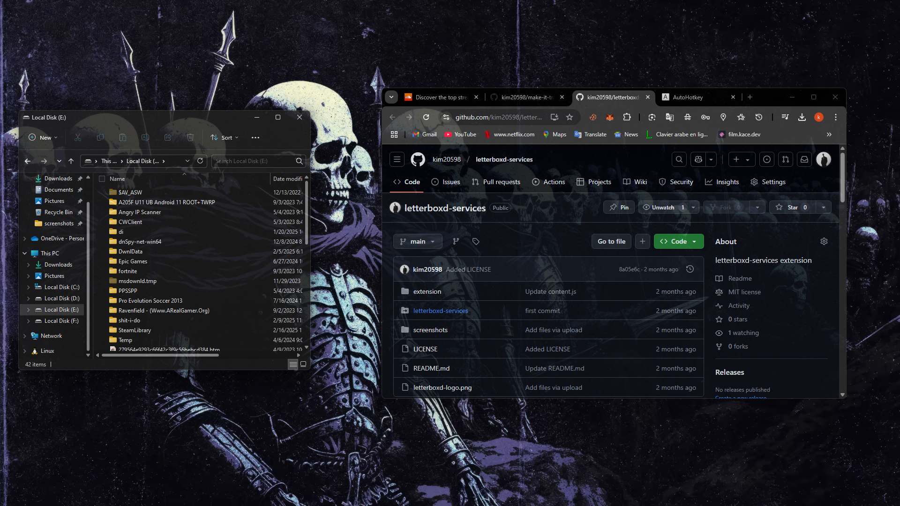
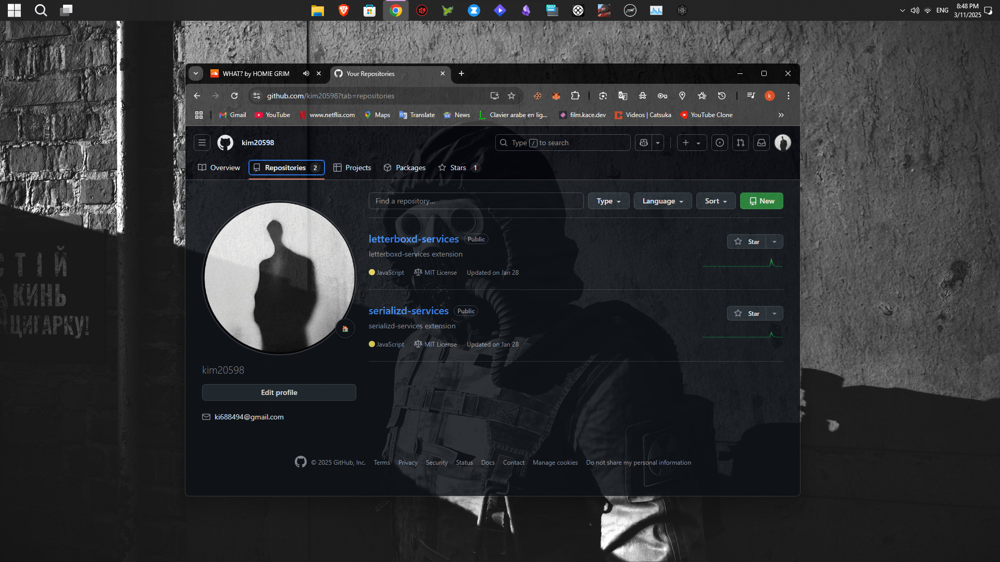

<br />
<p align="center">
  <a href="https://github.com/kim20598/make-it-transparent.git">
    
  </a>  
  
  <h3 align="center">make-it-transparent</h3>

  <p align="center">
    make-it-transparent provides you with transparent background for anything in windows.
    <br/>
    <br/>

## About The Project

<br />


<br/>
<br />


<br/>

 make-it-transparent is a script that will make anything transparent by few click .

## Installation

u can take it throw git [manually](#manual-installation).

or just download it from the green button [make-it-transparent](https://github.com/kim20598/make-it-transparent.git).

## Manual Installation

1. Clone the repo

   ```sh
   git clone https://github.com/kim20598/make-it-transparent.git
   ```

### the req app

1. Open your browser and go download [autohotkey](https://www.autohotkey.com/)
2. click the script to start it
3. go to ur browser ot anything that u wanna make it transpernt
4. jut clik "Crt+Alt" and right mouse click to turn it on and off
